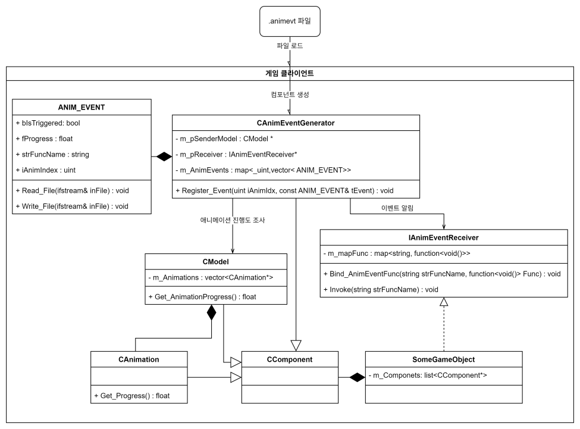
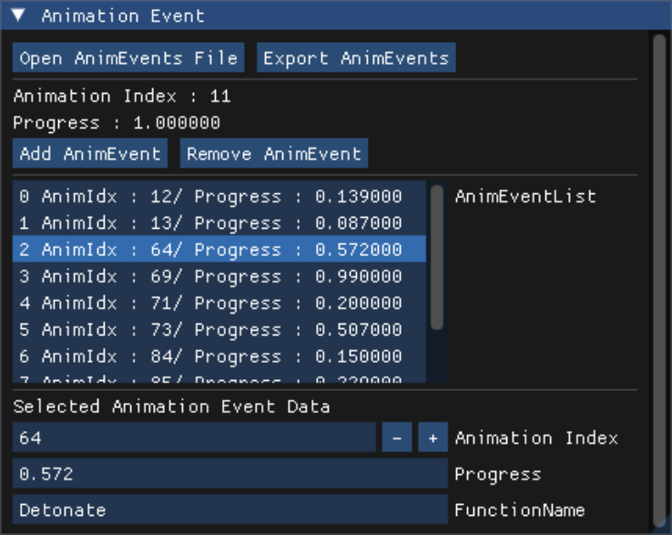
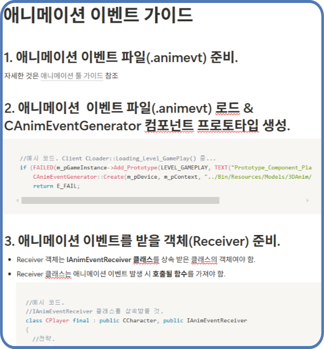

## 배경

견습 기사 모험기 모작은 7인 팀이 자체 DirectX11 엔진 위에서 만든 프로젝트였고,
저는 애니메이션과 플레이어를 담당했습니다. **이 사례의 애니메이션 시스템, 애니메이션 이벤트 시스템과
애니메이션 툴은 제가 단독으로 구현했고, 팀원들은 이 시스템을 사용하는 쪽이었습니다**
(관련 엔진·툴 커밋은 전부 제 계정이고, 팀원 커밋은 콜백을 바인딩해 쓰는 쪽에만
있습니다).

이걸 만들기 전까지는 **원하는 애니메이션 타이밍에 맞춰 함수를 호출하는 수단이
사실상 없었습니다.** 검을 휘두르는 모션에서 칼날이 지나가는 순간에 공격 판정을
켜거나, 도장을 내리찍는 순간에 이펙트를 터뜨리는 것처럼 "이 모션의 이 지점"에
로직을 걸어야 하는 요구가 계속 나오는데, 그걸 받아줄 자리가 없었던 겁니다.

그래서 다음 네 가지를 목표로 잡았습니다.

- 임의의 모델의, 임의의 애니메이션이, 임의의 진행도만큼 재생됐을 때 임의의 함수가
  호출돼야 합니다.
- 이벤트 정보는 별도의 파일로 저장돼야 합니다.
- 클라이언트가 그 파일을 로드해서, 로드된 데이터를 기반으로 이벤트가 발생해야 합니다.
- **2D 스프라이트 애니메이션과 3D 스켈레탈 애니메이션 모두**에서 이벤트가 발생해야
  합니다.

### 어려웠던 점

**하나는 2D와 3D를 한 시스템으로 묶는 것이었습니다.** 원작이 2D 그림책과 3D 세계를
오가는 게임이라 플레이어부터가 2D 모델과 3D 모델을 둘 다 갖고 있었고, 둘은 재생
구조가 완전히 다릅니다(한쪽은 스프라이트 프레임 진행, 다른 쪽은 트랙 포지션 진행).
이벤트 시스템이 이 둘 중 하나에만 붙으면 절반은 다시 손으로 처리해야 했습니다.

**다른 하나는 이벤트 데이터를 어디에 둘 것이냐였습니다.** 가장 단순한 방법은 이미
있는 `.model`·`.model2d` 파일 안에 이벤트 데이터를 같이 넣는 것이었는데, 그러면
그 모델 파일을 읽는 **다른 툴 프로젝트들(맵 툴 등)까지 크게 수정해야 하는 상황**이었습니다.
이벤트 하나 넣자고 남의 툴을 건드리게 되는 셈이라, 이걸 피할 방법을 고민한 끝에 이벤트
데이터를 별도 파일로 빼기로 했습니다. 어떤 점들을 저울질했는지는 아래 '대안 비교'에
적었습니다.

## 구현

툴에서 찍고 → 파일로 굽고 → 런타임이 읽어 발동하는, 세 단계 파이프라인으로
만들었습니다.



이벤트 하나는 **어떤 애니메이션의 / 어느 진행도에서 / 어떤 이름을 부를지** 세 가지만
갖습니다. `CAnimEventGenerator`는 컴포넌트로 만들어 이벤트 목록을 들고 매 프레임
모델의 진행도를 확인하고, `IAnimEventReceiver`는 이름과 함수를 짝지어두는 인터페이스로
분리했습니다.

```cpp
struct ANIM_EVENT { _uint iAnimIndex; string strFuncName; _float fProgress; _bool bIsTriggered; };

// 받는 쪽 — 이름에 함수를 짝지어두기만 하면 됩니다
class IAnimEventReceiver {
public:
    void Bind_AnimEventFunc(string _strFuncName, function<void()> _Func) { m_mapFunc[_strFuncName] = _Func; }
    void Invoke(string _strFuncName) { m_mapFunc[_strFuncName](); }
protected:
    map<string, function<void()>> m_mapFunc;
};

// 보내는 쪽 — 진행도가 이벤트 지점을 넘어섰으면 이벤트을 부릅니다
void CAnimEventGenerator::Update(_float fTimeDelta)
{
	_uint iCurAnimIdx = m_pSenderModel->Get_CurrentAnimIndex();
	if (m_AnimEvents.find(iCurAnimIdx) == m_AnimEvents.end())
		return;
	vector<ANIM_EVENT>& Events =  m_AnimEvents[iCurAnimIdx];
	_float fProgress = m_pSenderModel->Get_CurrentAnimProgeress();
	for (ANIM_EVENT& tEvnt : Events)
	{
		if (tEvnt.bIsTriggered || false == m_pSenderModel->Is_DuringAnimation()) continue;

		_bool bReached = m_pSenderModel->Is_ReversingAnimation()
			? (fProgress <= tEvnt.fProgress) : (fProgress >= tEvnt.fProgress);

		if (bReached)
		{
			m_pReceiver->Invoke(tEvnt.strFuncName);
			tEvnt.bIsTriggered = true;
		}
	}
}
```

**2D·3D를 함께 지원하는 문제는 진행도를 기준으로 삼아서 풀었습니다.** Generator는
구체 모델 클래스를 모르고 `CModel` 추상 인터페이스의 `Get_CurrentAnimProgeress()`만
봅니다. 프레임 수로 세거나 시간으로 셌다면 2D용·3D용 분기가 필요했겠지만, 0~1로
정규화된 진행도만 쓰기 때문에 재생 구조가 달라도 같은 코드가 그대로 돌아갑니다.
그래서 플레이어처럼 두 모델을 다 가진 오브젝트는 **같은 Receiver에 3D용 Generator와
2D용 Generator를 하나씩 붙이는 것으로** 끝납니다.

`ANIM_EVENT` 구조체는 자기 자신을 읽고 쓰는 `ReadFile`·`WriteFile`을 직접 갖고
있어서, 툴이 저장한 바이너리를 런타임이 같은 코드로 읽습니다. 툴에만 필요한
`Export_AnimEvents`는 `#ifdef _TOOL`로 감싸 클라이언트 빌드에는 들어가지 않게 했습니다.

찍는 쪽은 애니메이션 툴에 ImGui 패널로 붙였습니다. 애니메이션을 재생하다가 원하는
지점에서 `Add AnimEvent`를 누르면 그 순간의 진행도가 그대로 이벤트가 되고, 목록에서
골라 애니메이션 인덱스·진행도·함수 이름을 고쳐 파일로 내보냅니다.



### 애니메이션 이벤트 조건 체크

이벤트마다 `bIsTriggered` 플래그를 두고 한 번 발동하면 다시 안 부르게 했는데, 재생
방식이 늘어나자 이 플래그가 두 번 문제를 일으켰습니다.

- **반복 재생** — 애니메이션이 한 바퀴 돌아 처음으로 돌아가도 플래그가 켜진 채라
  두 번째 루프부터는 이벤트가 안 나왔습니다. `CAnimation`이 자기 애니메이션에 걸린
  `ANIM_EVENT` 포인터들을 들고 있게 하고, 루프해서 `Reset()`될 때 그 플래그들을
  내리도록 고쳤습니다.
- **역재생** — 진행도가 1.0에서 0.0으로 거꾸로 흐르는데 비교는 "진행도가 이벤트 지점
  이상"이라, 조건이 처음부터 참이었습니다. 역재생을 시작하는 순간 그 애니메이션에
  걸린 이벤트가 한꺼번에 전부 발동했습니다. 모델이 역재생 중인지 물어보고 비교
  방향을 뒤집는 것으로 해결했습니다.

발동 조건에는 `Is_DuringAnimation()`이 하나 더 붙어 있습니다. **모델이 지금 실제로
애니메이션을 진행시키고 있는지**를 뜻하고, ① 반복이 아닌 애니메이션이 끝까지 재생돼
마지막 프레임에 멈춰 있을 때, ② 3D 모델이 이전 애니메이션에서 다음 애니메이션으로
블렌딩되는 전환 구간을 지날 때, ③ 애니메이션이 없는 모델일 때 false가 됩니다.

②가 진행도 기준 방식의 사각지대입니다. 전환 구간에서는 진행도 계산에 쓰이는 트랙
위치가 애니메이션 길이가 아니라 **전환 시간을 기준으로** 흐르기 때문에,
`Get_CurrentAnimProgeress()`가 실제 재생 위치가 아닌 0에 가까운 값을 돌려줍니다.
이 조건이 없으면 역재생 비교(`진행도 <= 이벤트 지점`)에 그 값이 들어가, 전환하는
동안 이벤트가 전부 터집니다. 진행도가 재생 위치를 뜻하지 않는 구간을 아예 비교에서
빼주는 역할입니다.

### 팀을 위한 가이드 제작

시스템만 만들어두면 팀원이 바로 쓰기 힘들 거라고 생각했습니다. 그래서 따라만 하면 되는 가이드를 예시 코드와 함께 써서
공유했습니다.  
`.animevt` 준비 → 프로토타입 등록 → `IAnimEventReceiver` 상속 후 문자열 키에 함수 바인딩 → Generator 생성 시 Receiver와 SenderModel 넘기기까지 4단계로 구성돼있으며,  `std::bind`가 처음인 팀원을 위한 설명도 같이 넣었습니다.



가이드 전문 링크: [애니메이션 이벤트 가이드](https://silicon-humor-0e8.notion.site/184c1ed420d180a4949df8dfb7f0e4e0)

## 장단점

- **장점 — 툴과 게임 로직이 문자열 하나로만 붙어 있습니다.** 툴은 그 이름으로 무슨
  함수가 불릴지 전혀 모르고, 게임 쪽은 이벤트가 언제 찍혔는지 몰라도 됩니다. 그래서
  새 이벤트를 추가할 때 툴을 고칠 일이 없고, 게임 쪽은 바인딩 한 줄만 늘어납니다.
- **장점 — 이벤트 데이터가 모델 파일과 분리돼 있습니다.** 이벤트를 수정해도 모델
  파일을 다시 열 필요가 없고, 다른 모델이 같은 이벤트 파일을 쓰거나 같은 모델이 여러
  이벤트 파일을 쓰는 것도 됩니다.
- **장점 — 2D·3D 구분 없이 붙습니다.** 진행도만 보기 때문에 스프라이트 애니메이션과
  스켈레탈 애니메이션에 같은 컴포넌트가 그대로 올라갑니다.
- **장점 — 제가 아닌 팀원들이 직접 썼습니다.** 플레이어(검 던지기·공격·도장 찍기·기폭·
  회전 공격 등), 몬스터 6종, 책, 도시락까지 **9개 클래스에서 21개의 콜백**이 이 시스템
  위에 올라가 있습니다. 이 중 제가 붙인 것은 담당이었던 플레이어와 도시락 2개 클래스,
  10개 콜백이고, **나머지 7개 클래스 11개 콜백은 팀원 3명이 각자 직접 바인딩한
  것입니다**(바인딩 코드의 커밋 작성자 기준). 제가 옆에서 붙여준 게 아니라 가이드만
  보고 각자 붙였다는 뜻이라, 이 시스템이 남이 쓸 수 있는 물건이었는지에 대한 답은
  이쪽이라고 생각합니다.

- **단점 — 문자열 키라 오타를 컴파일러가 못 잡습니다.** 툴에서 함수 이름을 잘못
  적으면 빌드는 그대로 통과하고, `Invoke()`가 등록되지 않은 키에 접근해 런타임에
  문제가 생깁니다.
- **단점 — `.animevt`가 바이너리라 툴 없이는 열어볼 수도, 고칠 수도 없습니다.**
  진행도 숫자 하나를 바꾸려고 해도 툴 프로젝트를 켜야 합니다.
- **단점 — 콜백이 `function<void()>`라 인자를 넘길 수 없습니다.** 이벤트마다 다른
  값(예: 판정 크기, 이펙트 종류)을 넘기려면 받는 쪽 함수를 따로 만들거나 멤버 변수로
  미리 넣어둬야 합니다. 만들 당시에도 아쉬웠던 부분이라 툴에서 float형 데이터를 몇 개
  추가할 수 있게 해볼까 생각했지만, 당장 떠오르는 사용처가 없었고 인자 이름에 명시적인
  이름이 아닌 걸 넣는 것에 거부감이 들기도 해서, 빠듯한 개발 기간을 감안해 그냥
  넘어갔습니다.

## 대안 비교

두 갈래에서 고민이 있었습니다. 하나는 **이벤트 데이터를 어디에 둘 것인가**,
다른 하나는 **콜백을 무엇으로 식별할 것인가**입니다.

### 이벤트 데이터를 어디에 둘 것인가

| | 모델 파일(.model/.model2d)에 포함 | 별도 파일(.animevt) — 선택 |
|---|---|---|
| 모델 로드 코드 | 모델 파일을 쓰던 다른 프로젝트의 로드 코드까지 수정 필요 | 수정 없음 |
| 재사용 | 모델 1 : 이벤트 1로 고정 | 다른 모델이 같은 이벤트 파일 사용 가능, 같은 모델이 여러 이벤트 파일 사용 가능 |
| 이벤트 수정 범위 | 모델 파일을 다시 열고 수정 | 이벤트 파일만 다시 내보내기 |
| 모델 클래스 | 책임이 늘어 복잡도 상승 | 응집도 유지 |

모델 파일에 같이 넣는 쪽이 파일 수는 줄지만, 이미 그 모델 포맷을 쓰던 다른 프로젝트의
로드 코드까지 건드려야 했고 모델 클래스가 이벤트까지 책임지게 됩니다. 작업 범위를
최소화하는 쪽을 골랐습니다.

### 콜백을 무엇으로 식별할 것인가

| | enum | 정수 인덱스 | 문자열 키 — 선택 |
|---|---|---|---|
| 오타 검출 | 컴파일 타임에 잡힘 | 못 잡음 | 못 잡음 |
| 이벤트 추가 비용 | 클라 프로젝트와 툴 프로젝트 **양쪽에** enum 추가 | 낮음 | 낮음 |
| 사용 코드 가독성 | 좋음 | 나쁨 — 숫자만 봐서는 무슨 이벤트인지 알 수 없음 | 좋음 |

enum은 컴파일러가 오타를 잡아주지만, **툴이 게임에 어떤 이벤트가 있는지 알고 있어야
합니다.** 이벤트 하나 추가하려고 클라 프로젝트와 툴 프로젝트 양쪽에 enum을 추가하는
번거로운 과정이 매번 필요해집니다.  
정수 인덱스는 그 비용은 없지만, 사용하는 코드만 봐서는 어떤 애니메이션 이벤트인지 알기 어려워서 조금만 지나면 금방 뭐였는지 잊어버릴
것 같았습니다.  
문자열 키는 오타를 런타임까지 못 잡는 대가가 있지만, 툴과 게임을 서로 모르는 상태로 떼어놓으면서 사용 코드도 읽히는 쪽이라 이걸 골랐습니다.

## 회고

- 지금 다시 만든다면 **`.animevt`를 바이너리가 아니라 json처럼 직접 열어 고칠 수 있는
포맷으로 저장하겠습니다.** 값 하나 바꾸자고 툴 프로젝트를 매번 여는 게 솔직히
번거로웠습니다.

- **콜백에 인자를 넘길 수 있게 하는 것도, 지금 생각해 보면 그때 넣어뒀어도 괜찮았을 것
같습니다.** 당시에는 인자 이름이 명시적이지 않은 게 걸려서 접었던 부분입니다.
