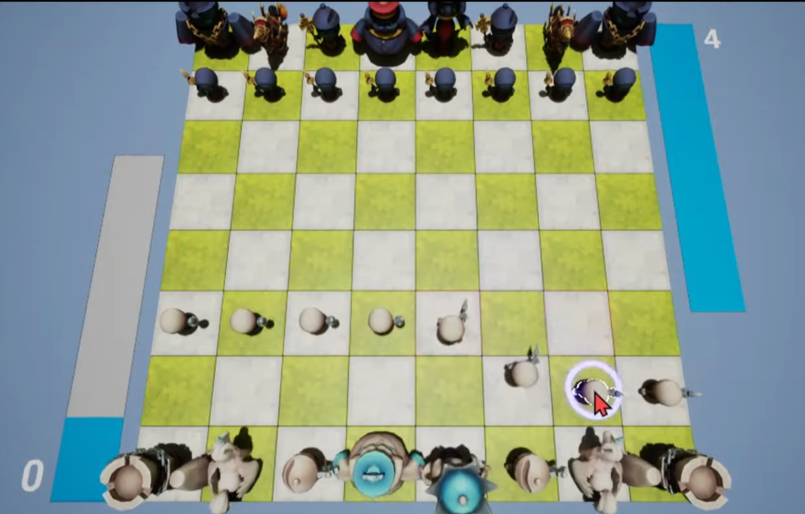
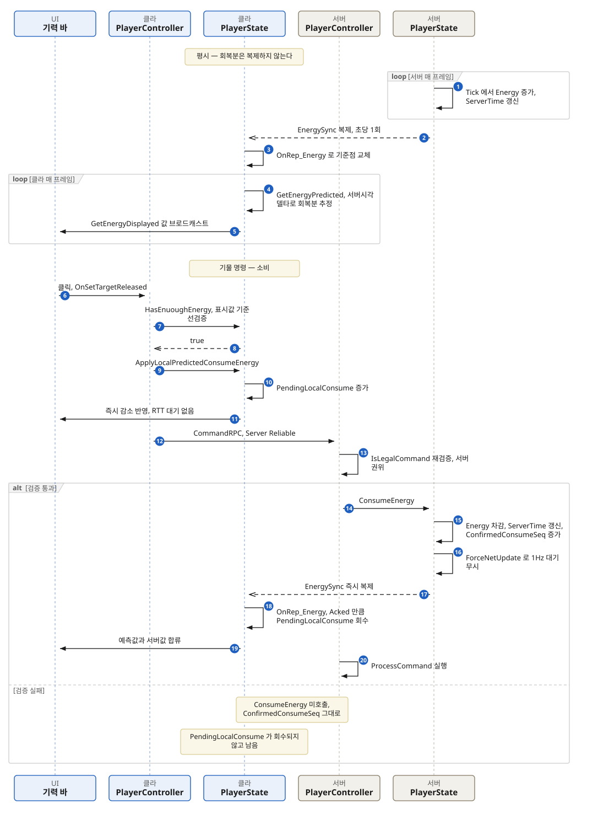

## 배경



RTChess는 턴을 주고받는 체스가 아니라, **기력이 차오르는 만큼 언제든 기물에 명령을
내리는** 방식입니다. 기력은 최대 4까지 초당 0.25씩 차오르고 명령 한 번에 1을 씁니다.
이 값이 곧 "지금 움직일 수 있느냐"를 결정합니다.  

네트워크 동기화 구조를 점검하다가, **기력 값이 기본 복제 설정에 따라 높은 빈도로
복제되고 있다는 것을 발견했습니다.** 언리얼의 기본 복제 빈도는 초당 100회입니다.
기력은 UI에 보여주는 것이 주 목적인데, 그 표시를 위해 초당 100번을 실어 보내고 있던
셈입니다.

그런데 **기력은 일정한 속도로 회복되는 선형 데이터입니다.** 마지막으로 받은 값과
**그 값이 몇 시 기준인지**만 알면, 클라이언트가 지금 값을 스스로 계산할 수 있습니다.
계산으로 메울 수 있는 것을 계속 실어 보낼 이유가 없다고 생각했습니다.

여기서 시작해 세 단계에 걸쳐 다듬었습니다. **한 번에 지금 형태가 나온 게 아니라,
해결법을 적용한 뒤 드러난 문제를 하나씩 잡은 결과입니다.**

**어려웠던 점**  
네트워크 지연 시간이 최대 200ms인 환경에서도 이상 현상 없이 제대로 동작할 것을 요구 사항으로 설정했습니다.
## 구현

### 1단계 — 회복은 보내지 말고 계산하게

복제하는 것은 구조체 하나뿐입니다. `FEnergySync`는 **기력 값, 그 값의 서버 기준 시각,
그리고 서버가 승인한 소비 횟수**를 담습니다.

클라이언트는 복제받은 값을 그대로 쓰지 않고, 거기에 "마지막 갱신 시각부터 지금까지
흐른 시간 × 회복 속도"를 더해서 씁니다. 기준은 양쪽이 공유하는
`GetServerWorldTimeSeconds()`입니다. 이렇게 하면 값이 뜸하게 와도 화면은 매 프레임
이어집니다.

그래서 **주기적 복제는 초당 1회까지 낮추고, 대신 기력을 소모할 때는 `ForceNetUpdate`로
즉시 동기화**하도록 나눴습니다. 예측이 어긋날 수 있으므로 **실제 소비와 최종 값 판정은
서버 권위로 남겨**, 예측 오차가 게임 로직에 영향을 주지 않게 했습니다.

### 2단계 — 지연이 큰 환경에서 UI가 늦게 반응하는 문제

여기까지 하고 나니 다른 게 걸렸습니다. **지연이 큰 환경에서 기력을 쓸 때 UI 반응이
눈에 띄게 늦었습니다.** 클라이언트가 소모를 요청하고 서버가 처리해 응답이 돌아오기까지
기다린 뒤에야 바가 줄었기 때문입니다.

회복과 달리 **소비는 계산으로 메울 수 없습니다.** "플레이어가 명령했고 서버가 받아들였다"는
사건이라 서버만 압니다. 그래서 클라이언트가 로컬 소비 예측값 `PendingLocalConsume`을
따로 들고, 입력 시점에 표시값에서 먼저 빼도록 했습니다.

### 3단계 — 표시 기력이 튀는 문제

그랬더니 이번엔 **기력을 쓸 때 표시 기력이 순간 올라갔다가 다시 내려가는 현상**이
생겼습니다. 서버의 주기적 기력 갱신 타이밍과 로컬 소비 타이밍이 교차하는 경우가
원인이었습니다.

그래서 `FEnergySync`에 **서버가 승인한 소비 횟수 `ConfirmedConsumeSeq`** 를 넣고,
클라이언트는 그 번호가 몇 개 올라갔는지를 보고 딱 그만큼만 로컬 예측값을 덜어내도록
보정했습니다. 승인된 개수를 기준으로 삼으니 타이밍이 교차해도 이중으로 빠지거나
되돌아오지 않습니다.

```cpp
// 화면에 그리는 값 = 서버 시각으로 계산한 회복분 − 아직 승인 안 난 소비분
float ARTChessPlayerState::GetEnergyDisplayed() const
{
    return FMath::Clamp(GetEnergyPredicted() - PendingLocalConsume, 0.f, MaxEnergy);
}

// 회복분은 복제받은 값이 아니라 서버 기준 시각과의 차이로 계산한다
float ARTChessPlayerState::GetEnergyPredicted() const
{
    const float dt = FMath::Max(0.f, CachedGS->GetServerWorldTimeSeconds() - EnergySync.ServerTime);
    return FMath::Clamp(EnergySync.Energy + EnergyRegenSpeed * dt, 0.f, MaxEnergy);
}

// 서버가 승인한 소비 건수만큼만 로컬 예측값을 덜어낸다
void ARTChessPlayerState::OnRep_Energy()
{
    uint32 Acked = EnergySync.ConfirmedConsumeSeq - LastConfirmedConsumeSeq;
    LastConfirmedConsumeSeq = EnergySync.ConfirmedConsumeSeq;
    PendingLocalConsume = FMath::Max(0.f, PendingLocalConsume - Acked * EnergyConsumption);
}
```

### 차감의 권한은 서버에만

클라이언트가 하는 일은 화면에 그릴 값을 미리 맞춰두는 것뿐이고, 실제 기력은 서버의
`ConsumeEnergy`에서만 줄어듭니다. 클라이언트가 보낸 명령은 서버의 `CommandRPC`에서
`IsLegalCommand`로 **한 번 더 검증**된 뒤에야 소비로 이어집니다.

클라이언트 쪽 검사도 예측값을 씁니다. `HasEnuoughEnergy`는 클라이언트에서 표시값
기준으로 판정하기 때문에, 승인이 오기 전에 연달아 명령을 넣어 기력을 초과해서 쓰는
것이 막힙니다.

지금까지의 흐름을 서버와 클라이언트로 나눠 그리면 아래와 같습니다.



## 장단점

- **장점 — 복제를 줄여도 UI가 끊기지 않습니다.** 회복분이 복제로 오는 게 아니라 매
  프레임 계산되는 값이라, 주기적 복제를 초당 1회까지 낮춰도 기력 바가 이어집니다.
- **장점 — 지연이 큰 환경에서도 입력에 즉시 반응합니다.** 소비가 서버 왕복을 기다리지
  않고 화면에 먼저 반영됩니다.
- **장점 — 표시값이 튀지 않습니다.** 승인을 불리언이 아니라 개수로 세기 때문에, 서버
  갱신과 로컬 소비 타이밍이 겹쳐도 어긋나지 않고 밀린 승인이 한 번에 와도 그만큼만
  정확히 정산됩니다.
- **장점 — 그러면서 서버 권위가 유지됩니다.** 예측은 표시용이고, 실제 차감은 서버가
  명령을 다시 검증한 뒤에만 일어납니다.
- **단점 — 서버가 명령을 거절하면 되돌릴 길이 없습니다.** 서버가 `CommandRPC`에서
  검증에 실패하면 `ConfirmedConsumeSeq`가 올라가지 않는데, `PendingLocalConsume`은
  이 번호로만 줄어들고 다른 곳에서 초기화되지 않습니다. 그래서 거절당한 명령 하나당
  클라이언트 표시 기력이 1씩 낮게 남습니다. 이를 해결하기 위한 추가 로직이 필요합니다.
- **단점 — 서버 시계와 상수 회복 속도에 기댑니다.** 예측식이 `GetServerWorldTimeSeconds()`와
  고정된 회복 속도를 전제로 하기 때문에, 시각 동기가 흔들리거나 회복 속도가 도중에
  바뀌면 다음 복제가 올 때까지 표시값이 어긋납니다.
- **단점 — 초당 1회라는 값에 측정 근거가 없습니다.** 낮춰보고 잘 동작하는 것을 확인한
  수준이고, 어느 지점부터 깨지는지는 재지 않았습니다.

## 대안 비교

|  | A. 기본 복제 설정 그대로 | B. 프로퍼티 복제 대신 Client RPC | 선택한 방식 |
|---|---|---|---|
| 복제 빈도 | 초당 100회 (언리얼 기본값) | 없음 — 값이 바뀔 때만 전송 | 초당 1회 + 소모 시 즉시 동기화 |
| 회복 표시 | 복제받은 값을 그대로 표시 | 회복 중에는 아무것도 오지 않아 클라 계산이 필수 | 마지막 값 + 서버 시각 차이로 클라가 계산 |
| 소비 표시 | 서버 왕복이 끝난 뒤 반영 | 즉시 반영 후 정산. 정산 신호를 RPC 핸들러로 받음 | 즉시 반영 후 승인 개수로 정산 |
| 안정성 | 상 | 하 | 상 |

**A는 손대지 않았을 때의 상태입니다.** UI에 보여주는 것이 목적인 값을 초당 100번
실어 보내는 셈이라, 표시 품질에 비해 복제 비용이 과하다고 봤습니다. 다만 코드가 실제로
거친 경로는 100회에서 곧장 1회가 아닙니다 — 기력 시스템을 처음 넣을 때 빈도를 초당
10회로 지정해두고 예측 없이 약 6주를 보낸 뒤, 예측을 도입하면서 1회로 내렸습니다.
**빈도만 낮추는 것으로는 표시가 계단처럼 끊기기 때문에, 예측과 짝을 지어야 더 내릴 수
있었습니다.**

**B는 예측은 그대로 두고 전송 수단만 바꾸는 안입니다.** `FEnergySync`를 복제
프로퍼티로 두지 않고, 값이 바뀌는 순간 서버가 소유 클라이언트에게 Client RPC로
밀어주는 방식입니다. 주기적 복제라는 개념 자체가 사라져서 "필요할 때만 보낸다"는
면에서는 가장 깔끔합니다.

문제는 **프로퍼티 복제가 공짜로 주던 두 가지를 직접 만들어야 한다**는 점입니다.
하나는 초기 상태입니다. 프로퍼티 복제는 액터가 클라이언트에 처음 관련되는 시점에
현재 값을 반드시 한 번 보내주지만, RPC는 그때 아무것도 오지 않아 접속·재접속마다
초기값 전송을 따로 붙여야 합니다. 다른 하나는 유실 복구입니다. Unreliable로 보내면
패킷 하나가 빠졌을 때 다음 소비가 일어날 때까지 클라이언트 값이 낡은 채로 남고,
Reliable로 보내면 순서 보장 큐를 계속 태우게 됩니다. **초당 1회라는 낮은 빈도의 주기적
복제는 그 자체가 초기화·유실 복구 수단을 겸합니다.** Client RPC가 소유 커넥션에만
간다는 점도 있어서, 상대나 관전자에게 기력을 보여주게 되면 Multicast로 다시 나뉩니다.

선택한 방식이 치르는 비용은 **클라이언트가 예측·정산 상태를 들고 있어야 한다**는
점입니다. 위 단점에 적은 거절 처리 같은 예외도 여기서 나옵니다.