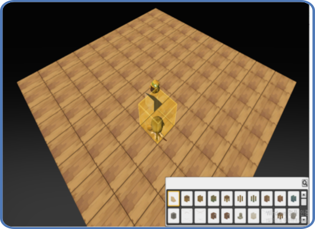
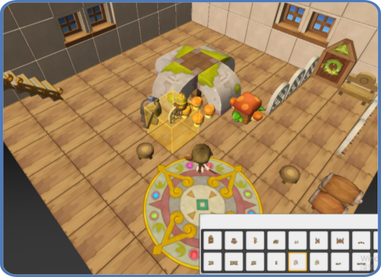
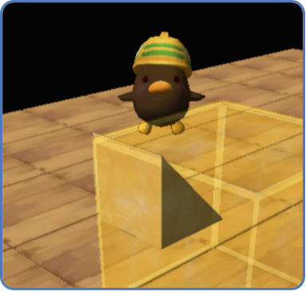
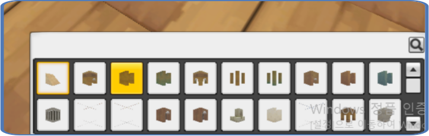

## 배경

하우징은 나만의 집을 꾸밀 수 있는 컨텐츠입니다. 원작 메이플스토리2에 있는 걸
모작했는데, 캐릭터가 블록을 들고 날아다니면서 집을 짓는
컨텐츠입니다. 이걸 만들려면 **플레이어가 배치한 맵 정보를 저장하고 다시 불러오는
기능**이 필요했습니다.

그리고 요구가 하나 더 있었습니다. 하우징만이 아니라 **게임에 실제로 쓸 맵을 만들
도구**도 필요했습니다. 헤네시스 마을이나 사냥터 같은 맵을 어딘가에서는 찍어내야
하는데, 이건 결국 "블록을 배치하고 그 배치를 파일로 저장한다"는 같은 일입니다.
그래서 두 요구를 한 시스템으로 묶었습니다 — 하우징 건설 모드를 그대로 맵 제작
툴로 썼고, 게임에 들어간 맵들도 전부 이걸로 만들었습니다.

전제 조건은 지형이 이미 그리드 큐브맵이라는 것이었습니다. 3차원 공간을 정육면체
셀로 나눠 관리하고, 행 크기가 X·열 크기가 Z일 때 `(x, z, y)`번째 셀의 인덱스는
`x + X * z + X * Z * y`입니다. 3차원 좌표가 정수 하나로 접히니 "어디에 뭘
놓았는가"를 인덱스 하나로 적을 수 있습니다.




### 어려웠던 점

**1. 반복되는 블록을 쉽게 만들고 효율적으로 저장할 방법이 필요했습니다.**
바닥 한 판을 깐다는 건 같은 블록을 수백 개 놓는 일입니다. 이걸 게임 안에서 하나씩
놓는 것도, 파일에 객체 수백 개로 적어두는 것도 둘 다 낭비였습니다.

**2. 설치할 수 있는 아이템 종류가 아주 많았습니다.** 이 프로젝트에서 사용한 맵용 모델 파일이 489개로 매우 많았고, 얼마든지 추가될 수 있어야 했습니다. 또한 사용자가 UI에서 이 489종을
구분하고 원하는 걸 골라낼 수 있어야 했고, 그러려면 아이템마다 **뭐가 어떻게 생긴 블록인지 보여줄 그림**이 필요했습니다.

게다가 이 아이템들은 **모델 형태와 종류에 따라 분류**돼야 했습니다. 셀을 꽉 채우는 큐브 형태라면 셀 경계만 가지고 바닥·천장 높이를 바로 계산할 수 있지만, 그렇지 않은
모델은 메시 콜라이더에 Raycast를 쏴서 구해야 합니다. 아예 충돌이 없어야 하는
것들도 있고, 스포너나 포탈처럼 설치했을 때 다른 종류의 지형 오브젝트가 돼야 하는
것도 있습니다. 무엇을 어느 쪽으로 다룰지가 아이템마다 정해져 있어야 했습니다.


## 구현

### 건설 모드

`B`키로 건설 모드를 토글합니다. 토글되면 조작 대상이 플레이어에서 `CBuilder`로
넘어가고(`Possess`), 추적 카메라의 타깃도 Builder로 바뀌고, 건설 메뉴 UI가
켜집니다. Builder는 `CPawn` 파생이라 플레이어와 같은 입력 경로를 그대로 씁니다.

Builder는 자식 오브젝트로 새 모델과 `CBuildPreview`(설치될 블록의 반투명
미리보기)를 각각 오프셋을 두고 달고 다닙니다. 조작은 방향키·`W`/`S`로 6방향 이동,
`SPACE` 배치, `R` 회전, `E` 삭제, `H` 저장입니다. 맵을 마우스로 좌클릭하면
Raycast로 맞은 셀을 찾아 그 한 칸 위로 Builder를 순간이동시킵니다 — 멀리 있는
곳까지 날아가지 않아도 되게 하는 장치입니다.



설치 가능 여부는 `CTerrain::Is_Buildable()` 하나로 판정합니다. 맵 범위 안인가,
인덱스가 유효한가, **그 셀이 비어 있는가** 세 가지입니다. 충돌 검사는 쓰지
않습니다 — 셀 하나에 오브젝트 하나라는 규칙이 곧 배치 규칙이기 때문입니다.
판정 결과는 매 프레임 설치 가능/불가 마커 이펙트 둘 중 하나를 스냅된 셀 위치에
띄워서 플레이어에게 되돌려줍니다.

### 맵 데이터 직렬화

맵은 json으로 저장하고 불러옵니다. 셀 하나가 json 객체 하나에 대응하고, 속성은
`Index`(셀 인덱스), `ItemId`(블록 아이템 식별번호), `Direction`(놓인 방향, 4방),
`Iteration`(같은 블록이 반복된 횟수), `ParentIndex`, `IntData`/`FloatData`(블록
타입별 추가 데이터)입니다.

여기서 `Iteration`이 반복 블록 문제를 푸는 열쇠입니다. 저장할 때 같은 블록이
연속되는 구간을 (시작 인덱스, 반복 횟수) 한 쌍으로 접습니다. 흔히 런렝스
부호화(RLE)라고 부르는 방식입니다. `ItemId`·`IntData`·`FloatData`·`Direction`이
모두 같고 인덱스가 바로 다음 칸으로 이어지면 새 객체를 만들지 않고 `Iteration`만
올립니다.

```cpp
json jTemp = pTerrainObj->ToJson();
int curIdx  = jCurObj["Index"];
int curIter = jCurObj["Iteration"];

if (jCurObj["ItemId"]    == jTemp["ItemId"]
    && jCurObj["IntData"]   == jTemp["IntData"]
    && jCurObj["FloatData"] == jTemp["FloatData"]
    && jCurObj["Direction"] == jTemp["Direction"]
    && (curIdx + curIter)   == jTemp["Index"])   // 인덱스가 연속인가
{
    jCurObj["Iteration"] = jCurObj["Iteration"] + 1;
}
else
{
    jCells.push_back(jCurObj);   // 연속이 끊겼으니 확정하고 새로 시작
    jCurObj = jTemp;
}
```

불러올 때는 반대로 `Iteration`만큼 인덱스를 하나씩 늘려가며 같은 블록을 찍어냅니다.
`MyHome.json`의 다음 한 덩어리는 "90번 블록이 0번 셀부터 100칸 연속"이라는
뜻입니다.

```json
{ "Index": 0, "ItemId": 90, "Iteration": 100,
  "Direction": 0, "IntData": [], "FloatData": [], "ParentIndex": 0 }
```

이 압축이 파일 크기만 줄이는 게 아닙니다. **바닥을 한 판 깔고 싶으면 블록 데이터
하나를 900번 복사하는 대신 `Iteration`에 900만 적으면 됩니다.** 테스트용 맵을
빠르게 만드는 데 이쪽이 더 크게 쓰였습니다.

### 아이템 489종 자동 등록: 모델 파일을 넣는 만큼 늘어나는 구조

리소스 모델 파일을 추가하면 자동으로 건설 아이템 데이터와 아이템 아이콘이 생성되는 구조를 만들었습니다. `CItemDataBase::Load_Data()`가
`resources/FBXs/MAP` 아래를 재귀 순회하면서 `.model` 파일을 만날 때마다 건설
아이템 하나를 만들고, `ItemId`를 순서대로 부여합니다.

종류는 **파일명 규칙**에서 파싱합니다. `he_ground_…`, `he_wall_…`처럼 두 번째
토큰이 그룹이고, `fi` 그룹이면 세 번째 토큰(`cubric`/`funct`/`nature`/`prop`/
`struc`)까지 봅니다. 거기서 나온 `BUILD_ITEM_TYPE`이 다시
`TERRAINOBJ_BLOCK_TYPE`(`CUBE`/`MESH`/`NON_BLOCK`)을 결정합니다 — 배경에서 말한
분류가 여기서 갈립니다. `CUBE`는 셀 경계 상수만으로 바닥·천장 높이를 즉시
계산하고, `MESH`는 메시 콜라이더에 Raycast를 쏘고, `NON_BLOCK`은 충돌을 갖지
않습니다.
현재 489개가 fi 346 · deform 54 · floor 39 · ground 34 · wall 16으로 나뉩니다.

이 파일명 규칙을 믿기로 한 이유는 작업 효율성 때문이었습니다. 원본 모델은 메이플스토리2 게임
리소스를 언패킹해서 얻었는데 이름이 잘 정리돼 있는 것처럼 보였습니다. 모든 파일명을 전부 확인한 건 아니지만, **제가 모든 모델을 하나씩 열어보고 분류하는
것보다 기존 이름 분류를 믿고 일괄 처리하는 편이 효율적이라고 봤습니다.** 그래야
나중에도 모델 파일만 넣으면 아이템이 얼마든지 늘어납니다. 모델 파일에 대응하지
않는 아이템(몬스터 스포너, 플레이어 스포너, 포탈)만 `ETCBuildItemData.json`에
따로 적었습니다.

남은 문제는 **아이콘**입니다. 

489종을 손으로 그릴 수도 없었고, 원작에서 아이콘
리소스를 구하지도 못했습니다. 그래서 **로딩 때 각 모델을 지정 위치에서 촬영해 아이콘을 만듭니다.** 300×300 렌더 타겟 하나를 잡아두고 뷰·투영 행렬을
고정한 뒤, 건설 아이템을 전부 순회하며 모델을 그리고, 결과 텍스처를 복사해
`<모델명>_icon`이라는 이름으로 텍스처 프로토타입에 등록합니다.

```cpp
for (auto& pairBuildItemData : m_mapItem[(_uint)ITEM_TYPE::BUILD])
{
    m_pRenderTarget->Clear();   // 렌더 타겟 전환 코드는 생략
    CModel* pModel = Clone_Proto_Component_Stock(pairBuildItemData.second->strModelTag);
    for (_uint i = 0; i < pModel->Get_NumMeshes(); i++)
    {
        pModel->Bind_Material(m_pShader, "g_DiffuseTexture", i, TEXTURE_TYPE::DIFFUSE, 0);
        m_pShader->Begin(DEFAULT_PASS);
        pModel->Render(i);
    }
    Safe_Release(pModel);

    m_pContext->CopyResource(pDestResource, pSourceResource);   // 결과를 별도 텍스처로 복사
    m_pDevice->CreateShaderResourceView(pDestResource, nullptr, &pNewSRV);

    // <모델명>_icon 이름으로 텍스처 프로토타입 등록
    pGameInstance->Add_Prototype(LEVEL_LOADING, wstrIconTag, CTexture::Create(..., pNewSRV));
}
```

아이템 데이터의 아이콘 태그도 모델 파일명에서 그대로 만들어지기 때문에, UI 쪽은
아이콘이 어디서 왔는지 알 필요가 없습니다. 건설 메뉴의 슬롯은 다른 인벤토리 슬롯과
똑같이 "아이템 데이터에 적힌 아이콘 태그로 텍스처 프로토타입을 Clone"하기만 합니다.

건설 메뉴 자체는 10열 그리드 리스트(`CUIListSelector`)에 스크롤러를 붙인
구성이고, 리스트 엔트리는 오브젝트 풀에서 재사용합니다. 489개 슬롯 오브젝트를
동시에 들고 있지 않고 보이는 만큼만 돌려씁니다.


## 장단점

- **장점** — 파일을 직접 열어 손으로 고치는 게 빠릅니다. 같은 블록을 길게
  늘어놓는 작업은 게임에 들어가서 블록을 900번 놓는 것보다 json에 숫자 하나
  바꾸는 게 훨씬 빠릅니다. 압축이 그 자체로 편집 인터페이스 역할을 합니다.

  건설 아이템은 **모델 파일을 폴더에 넣는 것만으로 추가**됩니다. 아이템 데이터도
  아이콘도 손으로 만들 게 없어서, 리소스를 더 들여와도 등록 작업이 늘지 않습니다.
  아이콘을 모델에서 직접 뽑기 때문에 모델을 교체해도 아이콘이 어긋나지 않습니다.

  하우징 컨텐츠 하나로 맵 에디터까지 해결했습니다. 실제 게임 맵을 이걸로
  만들었으니, 컨텐츠에 버그가 있으면 맵을 만들다가 바로 걸립니다.

- **단점** — **압축이 X축 방향에만 걸립니다.** 인덱스가 `x + X*z + X*Z*y`라
  인덱스 연속은 곧 X축 진행이고, 세로로 높게 쌓은 벽은 압축이 되지 않습니다.
  이건 알고 남겨둔 부분입니다. Y축 압축까지 하려면 추가 데이터와 로직이 필요한데,
  X축 압축과 상충되는 상황이 많을 것 같았고 실제로 Y축으로 높게 쌓는 일이 별로
  없을 거라고 봤습니다.

  **한 셀에는 오브젝트를 하나만 놓을 수 있습니다.** `Is_Buildable()`이 "셀이
  비어 있는가"만 보기 때문에, 작은 소품 여러 개를 한 칸 안에 배치하는 식의
  자유도는 없습니다. 셀 단위 인덱스가 저장 포맷을 단순하게 만들어준 대가입니다.

  **아이템 분류가 리소스 파일명에 묶여 있습니다.** 이름 규칙을 벗어난 파일이
  들어오면 분류가 틀어지고, `fi` 그룹에서 모르는 타입이 나오면 `assert`에
  걸립니다. 489개를 전부 검증하고 믿은 게 아니라 표본을 보고 믿은 것이라,
  리소스가 바뀌면 다시 깨질 수 있는 가정입니다.

  **모든 아이콘을 같은 카메라 위치에서 찍습니다.** 뷰·투영 행렬이 아이템별로
  조정되지 않아서, 작은 아이템은 화면에서 너무 작게 나오고 큰 아이템은 촬영 범위를
  넘어갑니다.

  **로딩할 때마다 489번 렌더하고 텍스처 489장을 만들어 물고 있습니다.** 로딩
  시간과 VRAM이 걱정되는 지점이었는데, 실제로 돌려보니 체감되는 문제가 없어서
  그대로 뒀습니다. 측정은 하지 않았습니다.

## 대안 비교

**바이너리 직렬화**를 검토했습니다. 파일을 직접 열어서 수정하는 게 빠르고
편한데 바이너리로 가면 그게 안 되고, 그렇다고 바이너리 편집 툴을 따로 만들자니
그것도 시간이 걸리는 작업이었습니다. "바닥 깔 때 `Iteration`에 900만 적으면 되게
하고 싶다"가 그대로 json을 고른 이유이기도 합니다.

압축 방식 자체는 다른 안을 검토하지 않았습니다. 연속 구간을 접는 방법이 떠올라서
그대로 갔습니다.

압축 효과는 저장돼 있는 맵 json 파일 세 개에서 블록 수와 json 객체 수를 세어
비교한 값입니다. **파일 크기와 로딩 시간은 측정하지 않았습니다.**

| | 압축 없음 (셀마다 객체 1개) | Iteration 압축 (선택) |
|---|---|---|
| `Henesys.json` — 헤네시스 마을 (30×30×30) | 1,648개 | 579개 (−64.9%) |
| `BayarPeak.json` (40×40×40) | 1,579개 | 402개 (−74.5%) |
| `HuntingPlace.json` (20×20×20) | 423개 | 168개 (−60.3%) |
| 손으로 편집 | 블록 하나당 객체 하나 | 연속 구간은 숫자 하나로 |
| 파일 크기 | 측정 안 함 | 측정 안 함 |
| 로딩 시간 | 측정 안 함 | 측정 안 함 |

아이템 등록 쪽은 **아이템마다 데이터와 아이콘을 손으로 만드는 방식**이 대안이었고,
489종과 이후 늘어날 아이템들 전부를 그렇게 감당할 수 없어서 선택하지 않았습니다. 원작에서 아이콘 리소스를
구하지 못한 것도 이유였습니다.

## 회고

아이콘을 **한 번 생성하면 파일로 저장해두는 방식**을 썼으면 좋았겠다는 생각이
듭니다. 지금은 실행할 때마다 489번을 다시 찍습니다.

더 좋은 건 아이콘 생성 툴을 따로 만드는 것이었습니다. 모든 아이템을 같은 위치에서
찍다 보니 어떤 아이템은 너무 작게 나오고 어떤 아이템은 촬영 범위를 넘어가는 문제가
있었는데, 아이템별로 카메라 거리와 각도를 잡아서 찍고 결과를 파일로 굽는 툴이
있었으면 그 문제까지 같이 해결됐을 겁니다.
