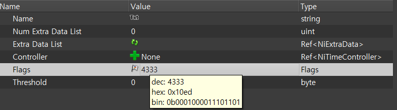

## 배경

메이플스토리2의 이펙트 리소스는 `.nif` 형식입니다. 이걸 제 자체 엔진에서 쓰려면
어떻게든 제가 읽을 수 있는 형태로 바꿔야 했습니다.

**먼저 FBX로 변환하는 길을 시도했습니다.** 이미 FBX 파이프라인이 있었으니, nif를
FBX로만 바꿔놓으면 나머지는 그대로 태울 수 있었을 것이라고 생각했습니다. Blender와 Noesis라는 툴을 사용해 변환해봤는데, 원하는 결과가 나오지 않았습니다. 메시 정보 정도만 멀쩡하고
텍스처링이나 애니메이션 같은 것들은 이상하게 나왔습니다. 알고 보니, nif에는 FBX가 지원하지 않는
기능들 — UV 애니메이션이나 알파 애니메이션 같은 것 — 이 있어서 애초에 완벽한 변환이
불가능했습니다.

그래서 **nif를 직접 뜯어서 제가 변환해야겠다고 생각했습니다.** 그런데 여기서 막혔습니다.
nif라는 파일 형식의 내부가 어떻게 생겼는지 알아낼 방법이 없었습니다.  
"*nif 파일을 읽어들이는 오픈소스가 있다면, 그 코드는
내부 구조를 알고 있을 것이다.*" 라고 생각했습니다. 그렇게 찾은 것이 nif 편집 툴 **NifSkope**입니다.
실제로 NifSkope로 같은 파일을 열어보니 앞선 FBX 변환 결과들보다 훨씬 정상적으로
보였습니다. nif를 제대로 해석하는 코드가 그 안에 있다는 뜻이었습니다.

**그래서 파싱을 다시 짜는 대신, NifSkope가 이미 파싱해놓은 결과를 가져다 쓰기로 했습니다.**
포맷을 처음부터 해석하는 건 남은 일정으로는 무리라고 봤습니다. NifSkope 안에 제
익스포터를 심어서, nif를 한 번 파싱한 그 구조화된 정보를 그대로 제 형식으로 써내는
방식입니다.


## 구현

NifSkope 소스 폴더에 `niftobinary.cpp` 한 파일을 추가하고 여기에 변환 로직을 전부 몰아넣었습니다.  
`NifSkope::load()`에서 nif 로드가
끝난 직후에 제가 작성한 변환 로직을 끼워 넣었습니다. **GUI로 nif 파일을 여는 것만으로 원본 옆에 같은 이름의 `.effmodel`이
생깁니다.**

NifSkope에서 nif파일을 읽고 저장한 구조를 파악하는 데 많은 시간을 들였습니다. nif는 블록들이 링크로 얽힌 그래프 구조입니다. 반면 제가 읽어야 할 바이너리는 앞에서부터
순서대로 읽히는 평평한 스트림이어야 합니다. 그래서 **변환을 두 패스로 나눴습니다.**

**1패스 — 인덱스 테이블 만들기.** `MakeBoneList` / `MakeMeshList` / `MakeMaterialList` /
`MakeTextureList` / `MakeTexturingList` / `MakeControllerList`가 nif 블록을 훑으면서
`map<QModelIndex, unsigned int>`에 블록마다 정수 번호를 매깁니다.

**2패스 — 그 번호로 기록하기.** `ExportBone` / `ExportMesh` / `ExportMaterial` /
`ExportTexture` / `ExportTexturing` / `ExportController`가 같은 순서로 바이너리를
써냅니다. 블록끼리의 링크는 전부 1패스에서 매긴 인덱스로 바뀝니다. 예를 들어 본이
자신에게 걸린 컨트롤러를 가리킬 때, 포인터가 아니라 컨트롤러 번호를 씁니다.

본 계층 구조는 조금 다르게 풀었습니다. 트리를 평평하게 펴면서 **각 본이 자기 자식
개수를 함께 기록**하게 했고, 런타임의 `CEffModel::Ready_Bones`가 이 개수를 보고 부모
인덱스를 따라가며 트리를 되세웁니다.

핵심은 **nif 파서를 한 줄도 쓰지 않았다**는 점입니다. NifSkope의 접근자
(`getBlock`, `inherits`, `get<T>`, `getLink`, `getChildLinks`)를 그대로 타고,
nif.xml 기반 스키마 해석은 전부 NifSkope에 맡깁니다.

```cpp
void MakeControllerList(NifModel* nifModel)
{
    mapControllerIndex.clear();
    unsigned int iControllerIndex = 0;
    int blockCount = nifModel->getBlockCount();
    for (int i = 0; i < blockCount; ++i) {
        QModelIndex iBlock = nifModel->getBlock(i);
        if (nifModel->itemName(iBlock) == "NiTransformController"
            || nifModel->itemName(iBlock) == "NiTextureTransformController"
            || nifModel->itemName(iBlock) == "NiAlphaController"
            || nifModel->itemName(iBlock) == "NiMaterialColorController"
            || nifModel->itemName(iBlock) == "NiFlipController")
        {
            mapControllerIndex[iBlock] = iControllerIndex++;
        }
    }
}
```

옮긴 컨트롤러는 이 5종입니다. **FBX 경로를 버리게 만든 UV 애니메이션
(`NiTextureTransformController`)과 알파 애니메이션(`NiAlphaController`)이 여기서
살아 돌아왔습니다.** 각각 `ControllerData`를 상속한 구조체가 키프레임을 읽어 써내고,
게임 쪽에서는 `CEffTransformController`·`CEffTextureTransfromController`·
`CEffAlphaController`·`CEffMaterialColorController`·`CEffFlipController`가 받습니다.

메시는 위치·노멀·UV·탄젠트와 인덱스 버퍼, 스킨용 본 가중치, 그리고 머티리얼·텍스처링
인덱스를 담습니다. 게임 클라이언트 쪽 `CEffModel`은 `Ready_Bones` → `Ready_Meshes` →
`Ready_Materials` → `Ready_Textures` → `Ready_Texturings` → `Ready_Controls` 순서로
익스포터가 쓴 순서를 그대로 되짚어 읽습니다.

## 장단점

- **장점 — 파싱을 통째로 건너뛰었습니다.** nif 포맷 명세를 해석하는 일을 NifSkope에
  맡기고, 저는 "이미 구조화된 것을 어떤 순서로 쓸 것인가"만 풀면 됐습니다. 남은
  일정 안에 끝낼 수 있었던 건 이 결정 덕분입니다.
- **장점 — FBX가 못 옮기던 것이 넘어왔습니다.** UV 애니메이션과 알파 애니메이션이
  살아났고, 옮긴 컨트롤러 5종은 전부 게임에서 실제로 사용했습니다.
- **장점 — 반복 작업이 없습니다.** 파일을 여는 것이 곧 변환이라, 이펙트를 추가할 때
  따로 할 일이 없습니다. 최종적으로 `.effmodel` 102개가 게임에 올라갔습니다.
- **단점 — 원작과 같은 이펙트를 끝내 얻지 못했습니다.** NifSkope 자체도 메이플스토리2의
  nif 이펙트를 완벽히 구동하지는 못합니다. 그 위에 얹은 익스포터도 거기까지가
  한계였습니다.
- **단점 — 비트 플래그를 완전히 해석하지 못했습니다.** 블렌드 옵션이나 애니메이션 옵션 같은
  것들이 0과 1로 이루어진 비트 형태로만 노출되는데, 각 비트가 무엇을 의미하는지에 대한
  설명이 불친절했습니다. 그래서 원하는 데이터를 온전히 가져오지 못했고, 가져온 데이터를
  쓰는 기능을 게임 쪽에 붙이는 것도 마찬가지로 어려웠습니다. **결국 모든 기능을 갖추지
  못한 채 프로젝트가 끝났습니다.** 아래는 NifSkope에서 AlpahProperty의 플래그를 캡처한 이미지입니다.   

  

- **단점 — 파일을 여는 것만으로 파일이 생깁니다.** 제가 쓰는 데는 불편하지는 않았지만,
  다른 사람이 쓰기엔 불친절합니다. 시간이 촉박해 로드 시점 즉시 변환하는 방식으로 구현했습니다.


## 대안 비교

|  | A. Blender로 FBX 변환 | B. Noesis로 FBX 변환 | C. nif 파서 직접 구현 | 선택한 방식 |
|---|---|---|---|---|
| 방식 | nif를 FBX로 바꿔 기존 FBX 파이프라인에 태움 | 동일 | nif 포맷을 직접 해석하는 코드를 작성 | NifSkope에 익스포터를 심어 파싱 결과를 그대로 씀 |
| 결과 | 메시 정도만 멀쩡, 텍스처링·애니메이션은 죄다 이상함 | 동일 | 시도하지 않음 | 컨트롤러 5종 포함 변환. 플래그류는 미해결 |
| 비용 | 낮음 | 낮음 | 포맷 명세 파악 — 일정상 무리로 판단 | NifSkope 코드 분석 + 익스포터 한 파일 |

**A와 B는 실제로 돌려보고 버렸습니다.** 변환 결과물이 아직 프로젝트 안에 같은 이펙트의
`_blender.fbx`와 `_noesis.fbx`로 나란히 남아 있습니다. 둘 다 FBX가 UV 애니메이션·알파
애니메이션을 담지 못한다는 같은 벽에 부딪혔습니다.

**C를 접은 이유는 순전히 일정입니다.** 포맷 내부를 알아낼 방법이 없는 상태에서 파서까지
직접 만드는 건 남은 시간으로는 무리라고 봤습니다. NifSkope를 고른 직접적인 계기도
여기 있습니다 — 그 툴로 파일을 열었을 때 그나마 정상적으로 보였다는 건, 제가 알아내야
할 것을 이미 알고 있는 코드가 그 안에 있다는 뜻이었습니다.

## 회고

다시 만든다면 다른 사람도 메뉴를 통해 사용할 수 있도록 **로드 시점 자동 변환이 아니라 메뉴에 export 기능 버튼을 추가하는
방식**으로 하고 싶습니다. 

그리고 **제대로 가져오지 못했던 데이터와 기능들을 더 자세히 분석해서 구현해보고
싶습니다.** 시간에 여유가 있다면, 각종 옵션 비트 플래그를 완벽히 해석하고, Quadratic Key 보간 기능 등 추가하지 못한 기능들도 구현해 원작과 똑같은 이펙트를 만들고 싶습니다.