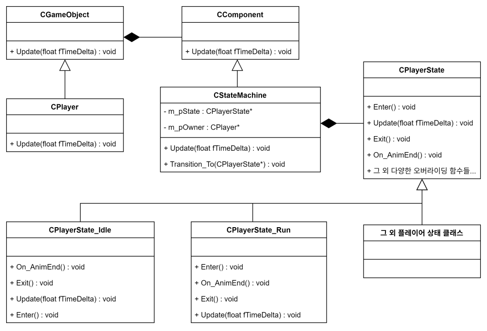

## 배경

견습 기사 모험기 모작은 7인 팀이 자체 DirectX11 엔진 위에서 만든 프로젝트였고,
저는 애니메이션과 플레이어를 담당했습니다. **상태 머신 구조(`CStateMachine`,
`CPlayerState`)와 상태 클래스 대부분은 제가 작성했고**, 36개 상태 클래스 중
`BackRoll`·`Pull`·`Mojam` 3개는 개발 막바지에 팀원이 추가한 것입니다.

원작은 2D 그림책과 3D 세계를 오가는 게임이라, **플레이어 하나가 두 좌표계에서
전혀 다르게 움직여야 했습니다.** 여기에 검·도장·라이플·제트팩·건틀릿 같은 장비와
포탈·물건 들기·밀기·벽 타기 같은 상호작용이 개발 기간 내내 계속 추가됐습니다.
플레이어가 지금 무엇을 하고 있느냐에 따라 받아야 할 입력도, 재생할 애니메이션도,
적용할 물리도 전부 달라지는 상황이었습니다.

그래서 다음을 요구 사항으로 잡았습니다.

- 플레이어의 상태를 **클래스 단위**로 관리할 수 있어야 합니다.
- 동시에 하나의 플레이어 상태 객체만 존재해야 합니다.
- 현재 상태에서 다른 상태로 전이될 수 있어야 합니다.
- 각 상태는 **진입·유지·탈출** 시의 동작을 각각 정의할 수 있어야 합니다.
- 새로운 플레이어 상태를 쉽게 추가할 수 있어야 합니다.
- 플레이어의 상태에 따라 **다른 입력**을 받을 수 있어야 합니다.

## 구현

`CStateMachine`을 컴포넌트로 만들어 플레이어에게 붙이고, 이 컴포넌트가 현재 상태에
해당하는 `CPlayerState` 객체 하나를 들고 돌립니다. 각 상태는 `CPlayerState`를
상속받아 `Enter()` / `Update()` / `Exit()` / `On_AnimEnd()`를 오버라이드하는 것으로
자기 동작을 구현합니다. 각 상태에서 다른 상태로의 전환을 책임집니다.



상태 전이는 `Transition_To()` 하나를 지납니다. 이전 상태의 `Exit()`를 부르고
해제한 뒤, 새 상태를 물리고 `Enter()`를 부릅니다. 이 순서가 한곳에 있어서
상태 클래스는 진입·탈출 처리를 자기 안에만 쓰면 되고, 호출 순서를 신경 쓸 일이
없습니다.

```cpp
void CStateMachine::Transition_To(CPlayerState* _pNewState)
{
	if (nullptr != m_pState)
	{
		m_pState->Exit();
		Safe_Release(m_pState);
	}
	m_pState = _pNewState;
	m_pState->Enter();
	for (auto& callback : m_listStateChangeCallback)
		callback(_pNewState);
}
```

상태 객체를 실제로 만드는 곳은 `CPlayer::Set_State(STATE)` 한 군데입니다. 상태
클래스들은 `new CPlayerState_Attack(this)`를 직접 부르지 않고 `Set_State(ATTACK)`만
부르기 때문에, 외부에서 상태 객체 생성/삭제를 신경 쓸 필요가 없고, 어떤 상태 enum이 어떤 상태 클래스에 대응하는지가 이 함수 안에서만
결정됩니다.

`On_AnimEnd()`가 있는 것은 애니메이션이 끝나야 풀리는 상태가 많기 때문입니다.
공격·구르기·물건 집기처럼 모션이 끝나는 시점이 곧 상태 종료인 동작은 시간을 세지
않고 애니메이션 종료 통보를 받아 다음 상태로 넘어갑니다.

### 상태 사이로 데이터를 넘기기

상태 객체는 전이될 때 해제되기 때문에, 이전 상태가 계산해둔 값을 다음 상태가
쓰려면 어딘가에 남겨야 합니다. 이 프로젝트에서는 그 자리를 `CPlayer`로 잡았습니다.
벽 타기가 대표적인 예입니다.

```cpp
// JumpDown 상태 — 벽을 감지해 도착 지점과 벽 법선을 계산한 뒤 CPlayer에 맡기고 전이
m_pOwner->Set_ClamberEndPosition(m_vClamberEndPosition);
m_pOwner->Set_WallNormal(XMVectorSetW(vBestNormal, 0.f));
m_pOwner->Set_State(CPlayer::CLAMBER);

// Clamber 상태 Enter() — CPlayer에서 도로 꺼내 시작 지점을 역산
m_vClamberNormal      = m_pOwner->Get_WallNormal();
m_vClamberEndPosition = m_pOwner->Get_ClamberEndPosition();
m_vClamberStartPosition = m_vClamberEndPosition
                        + m_vClamberNormal * m_fArmLength
                        + _vector{ 0, -m_fArmHeight, 0 };
```

## 장단점

- **장점 — 상태별로 입력 해석이 분리됩니다.** 같은 스페이스바가 서 있을 때는 점프,
  물건을 들고 있을 때는 내려놓기, 대포 포탈 위에서는 발사가 되는 식인데, 이걸
  플레이어 한 곳에서 분기로 판단하지 않고 각 상태의 `Update()`가 자기가 받을 입력만
  보게 했습니다.
- **장점 — 상태 관련 코드의 응집도가 높습니다.** 덕분에 해당 상태에서 일어나는 일은 전부 상태 클래스 하나만 보면 알 수 있었습니다. 구조를 모르는 사람도 상태를 추가할 수 있었습니다. 개발 막바지에
  팀원이 `BackRoll`·`Pull`·`Mojam` 세 상태를 추가했는데, `CPlayerState`를 상속하고
  `Set_State`에 case를 하나 더 붙인 것이 전부였습니다. 기존 상태 클래스나 상태
  머신은 건드리지 않았습니다.

- **단점 — 상태 간 공유 데이터가 `CPlayer`로 새어 나갑니다.** 위의 벽 타기처럼
  값을 넘길 때마다 `CPlayer`에 멤버와 getter·setter가 한 쌍씩 늘었습니다.
  `Get_ClamberEndPosition()`처럼 **특정 상태 전이 하나에만 쓰이는 접근자가 공용
  인터페이스에 올라앉는 셈**이라, 최종적으로 `CPlayer` 헤더의 `Get_`/`Set_`/`Is_`
  접근자가 80개를 넘습니다.
- **단점 — 상태를 나누는 기준이 없었습니다.** 복합적인 상태를 어떻게 정의할지
  기준을 정해두지 않아서, '점프 공격'을 *"JUMP 상태 중 공격 입력을 받은 것"*
  으로 볼지 *"JUMP 상태에서 ATTACK 상태로 전이"* 로 볼지가 그때그때
  달랐습니다. 그 결과 전이 조건이 불명확해지고, 일부 전이는 분기문에 의존하거나
  중복 구현됐습니다.
- **단점 — 전이 로직이 각 상태 클래스에 흩어져 있습니다.** 다음 상태를 각 상태가
  직접 정하기 때문에 상태끼리 서로를 알게 되고, 전체 전이 흐름을 한눈에 보기가
  어렵습니다. Idle 하나만 봐도 여섯 개 상태로 나가는 조건이 이 안에 들어 있습니다.

  ```cpp
  if (tKeyResult.bInputStates[PLAYER_INPUT_ATTACK])        m_pOwner->Set_State(CPlayer::ATTACK);
  else if (tKeyResult.bInputStates[PLAYER_INPUT_SPINATTACK]) m_pOwner->Set_State(CPlayer::SPINATTACK);
  else if (tKeyResult.bInputStates[PLAYER_INPUT_JUMP])       m_pOwner->Set_State(CPlayer::JUMP_UP);
  else if (tKeyResult.bInputStates[PLAYER_INPUT_ROLL])       m_pOwner->Set_State(CPlayer::ROLL);
  else if (tKeyResult.bInputStates[PLAYER_INPUT_THROWSWORD]) m_pOwner->Set_State(CPlayer::THROWSWORD);
  else if (tKeyResult.bInputStates[PLAYER_INPUT_MOVE])       m_pOwner->Set_State(CPlayer::RUN);
  ```

- **단점 — 상태 클래스가 너무 많아졌습니다.** 개발 기간이 지나며 상태 클래스가
  36개까지 늘었고, 일부는 중복된 구현을 갖게 됐습니다. 점프 하나에 `JumpUp`·
  `JumpDown`·`JumpAttack` 세 개가, 포탈 하나에 `StartPortal`·`JumpToPortal`·
  `ExitPortal` 세 개가 생기는 식이었습니다.

## 대안 비교

개발 중에 같은 문제를 다르게 풀 수 있는 방법을 두 갈래로 정리해뒀습니다.

### 전이 조건을 어디에서 판단할 것인가

**이건 상상해본 대안이 아니라, 직전 프로젝트에서 실제로 써봤던 방식입니다.**
바로 앞에 만든 메이플스토리2 모작에서는 전이를 데이터로 선언하는 상태 머신을
엔진에 넣어 몬스터·NPC·플레이어에 붙여 썼습니다. 조건으로 쓸 변수의 주소를 미리
등록해두고, 전이 규칙을 한 곳에 나열하는 방식입니다.

```cpp
// 메이플스토리2 모작 — 조건 변수를 등록하고, 전이 규칙을 선언적으로 쌓습니다
Add_ConditionVariable(MON_ANIM_CONDITION::AC_HP,   pDesc->iHp);
Add_ConditionVariable(MON_ANIM_CONDITION::AC_STUN, pDesc->bStun);

pTransition = Add_Transition(M_BS_MOVE, M_BS_DEAD);
Bind_Condition(pTransition, MON_ANIM_CONDITION::AC_HP,   CONDITION_TYPE::EQUAL_LESS, 0);
pTransition = Add_Transition(M_BS_MOVE, M_BS_STUN);
Bind_Condition(pTransition, MON_ANIM_CONDITION::AC_STUN, CONDITION_TYPE::EQUAL, true);
```

| | 전이를 데이터로 선언 (메이플스토리2 모작) | 상태 클래스 안에서 판단 (이 프로젝트) |
|---|---|---|
| 다음 상태 결정 | 전이 규칙 목록이 결정 | 현재 상태가 직접 지정 |
| 전이 흐름 파악 | 규칙 목록 한 곳에서 전부 보임 | 상태 클래스를 하나씩 열어봐야 함 |
| 상태 간 결합 | 상태끼리 서로 몰라도 됨 | 나가는 대상 상태를 전부 알아야 함 |
| 새 전이 추가 | 규칙 한 줄 | 출발 상태의 `Update()` 수정 |
| 전이가 잘못 일어났을 때 | 중단점을 걸 곳이 모든 객체가 공유하는 함수뿐 | 해당 상태 클래스에 그대로 중단점 |

**견습 기사 모험기에서 뒤쪽을 고른 것은 앞 프로젝트에서 디버깅이 너무 힘들었기
때문입니다. 이번에는 더 단순한 구조로 가자고 생각했습니다.**

전이가 제대로 일어나는지 확인하려면 `CState::Check_Transition()`,
`CState::Check_SubTransition()`, `CTransition::CheckConditions()` 안에 중단점을
걸어야 합니다. 그런데 이 함수들은 **상태 머신을 쓰는 모든 객체의 Update마다**
불립니다. 몬스터 한 마리의 특정 순간이 궁금해도 다른 객체들이 먼저 줄줄이 걸리기
때문에, **원하는 객체의 원하는 타이밍을 포착하는 것 자체가 일이었습니다.** 전이
규칙이 코드가 아니라 데이터라서 생긴 대가입니다.

그런데 개발이 진행되면서 생각이 바뀌었습니다. **상태 클래스가 너무 많아지니 결국
그 구조가 있으면 좋겠다는 쪽으로 기울었습니다.** 앞 프로젝트 방식의 장점만 가져올
수 있는 방법이 있으면 좋겠다고 생각했습니다. 

### 상태를 평면으로 둘 것인가, 계층으로 나눌 것인가

이 대안도 메이플스토리2 모작 프로젝트에서 실제로 썼던 방식입니다. 마찬가지로 디버깅에 불편함을 느껴, 이번엔 더 단순한 형태로 구현하려고 마음먹어서 왼쪽의 방식을 채택했습니다.

| | 평면 — 선택(이 프로젝트) | MainState + SubState(메이플스토리2 모작 프로젝트) |
|---|---|---|
| 점프 표현 | `JumpUp` / `JumpDown` / `JumpAttack` 세 개의 형제 클래스 | 점프라는 상위 상태 + 그 안의 단계 |
| 중복 | 세 클래스가 비슷한 낙하·착지 처리를 각자 가짐 | 상위 상태가 공통 처리를 가짐 |
| 상태 수 | 동작 조합마다 하나씩 늘어남 | 축이 늘어날 뿐 곱해지지 않음 |
| 구현 비용 | 낮음 — 상속 한 번 | 상위·하위 상태의 갱신 순서와 입력 우선순위를 따로 정해야 함 |

평면 구조는 처음에는 빠르고 명확했습니다. 문제는 동작이 조합될 때인데, '점프 중
공격'처럼 두 축이 겹치는 동작이 나올 때마다 조합 하나가 새 클래스 하나가 됩니다. 때문에 상태 클래스의 수가 폭발적으로 늘어났습니다. 상태를 계층적으로 만드는 것의 필요성을 실감했습니다.


## 회고

이 구조를 만들고 나서 개발 중에 문제를 네 가지로 정리해뒀고, 각각에 대해 이렇게
했으면 됐겠다는 방향까지 적었습니다.

1. **상태 간 공유 데이터** — 공유 데이터를 관리하는 별도의 클래스를 두고 상태들이
   그것을 공유하게 합니다. `CPlayer`가 상태 전이용 접근자를 떠안지 않게 됩니다.
2. **상태 구분 기준** — *'행동의 의도'* 와 *'물리적 상태'* 중 **하나를 상태 정의의
   기준으로 정하고 문서화**합니다. 각 상태의 진입·탈출·유지 조건도 함께 명문화합니다.
3. **전이 로직 분산** — 전이 조건을 상태 클래스 외부에서 관리하고, 상태 내부에서는
   탈출 조건만 판단하게 합니다.
4. **너무 많은 상태 클래스** — 상태 간의 포함 관계를 파악해 **MainState + SubState
   구조** 또는 계층적 상태 구조를 도입합니다.

3, 4번은 사실 새로 떠올린 방법이 아닙니다. **직전 프로젝트의 상태 머신이 이미 메인
상태와 서브 상태를 함께 들고 있었는데, 이번에는 단순함을 택하면서 가져오지 않았다가
결국 다시 필요해진 것입니다.**

**네 가지 모두 이 프로젝트에서는 적용하지 못했습니다.** 개발 기간 중에 상태 구조를
갈아엎는 변경이라 손대지 못한 채로 끝났고, 위 정리는 다음에 같은 것을 만들 때를
위한 것이었습니다.
