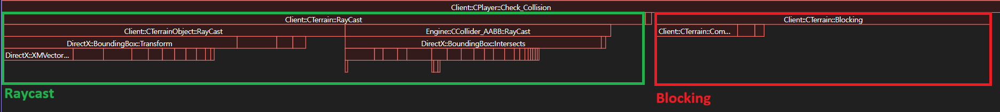
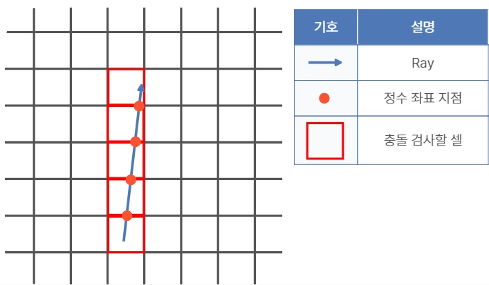

## 배경

CopyMaple2(메이플스토리2 모작, DirectX11 자체 엔진, 개인 프로젝트)는 그리드 기반
큐브맵으로 지형을 구성하고 있습니다. 캐릭터 충돌 처리를 프로파일링해봤더니, 충돌
검사/처리가 게임 로직 파트에서 가장 높은 CPU 점유율(12.98%)을 차지하고 있었고,
그중에서도 Raycast 비용이 절반 이상을 차지하고 있었습니다. Raycast는 캐릭터 이동
시 지형 블로킹 판정, 스킬 판정 등 여러 곳에서 매 프레임 반복 호출되는 핵심
경로였습니다.



문제를 어렵게 만든 조건은 이렇습니다. 그리드 맵이라 임의의 3D 좌표를 셀 인덱스로
바로 변환할 수는 있었지만, Ray가 시작점에서 목표까지 **어떤 순서로 셀을
통과하는지**는 따로 추적해야 했습니다. 이 순서를 모르면 가까운 셀에서 충돌이
발견돼도 먼 셀까지 계속 검사하게 되거나, 반대로 검사 순서가 꼬여 잘못된 셀에서
먼저 충돌 판정이 나버립니다.

## 구현

표준 3D DDA(Voxel Traversal)를 적용했습니다. X/Y/Z 세 축 각각에 대해 "셀 한 칸을
이동하는 데 드는 비용(TDelta)"과 "다음 경계면까지 남은 거리(TMax)"를 미리
계산해두고, 매 스텝마다 TMax가 가장 작은 축으로만 한 칸씩 전진하는 방식입니다.



`CTerrain::RayCast`의 전진 로직입니다. 세 축 중 가장 먼저 경계에 닿는 축을 골라
그쪽으로 한 칸 가고, 그 축의 TMax를 다음 경계까지 갱신합니다.

```cpp
// DDA step
if (fTMaxX < fTMaxY && fTMaxX < fTMaxZ)
{
    iX += iStepX;
    fT = fTMaxX;
    fTMaxX += fTDeltaX;
}
else if (fTMaxZ < fTMaxY)
{
    iZ += fStepZ;
    fT = fTMaxZ;
    fTMaxZ += fTDeltaZ;
}
else
{
    iY += iStepY;
    fT = fTMaxY;
    fTMaxY += fTDeltaY;
}
```

이 루프가 한 바퀴 돌 때마다 Ray가 통과하는 다음 셀 하나를 정확한 순서로 얻고,
그 셀에서만 실제 충돌 검사(`m_vecCubes[iIdx]->RayCast(...)`)를 수행합니다.

## 장단점

- **장점** — 검사 비용이 맵 크기와 완전히 무관해집니다. Ray가 실제로 지나는
  셀만 보므로 비용이 Ray 길이에만 비례하고, 맵이 아무리 넓어져도 그대로입니다.
  또 축 개수에 상관없이 일반화되는 알고리즘이라 Y축이 자연스럽게 포함됐고,
  이전 구현에 있던 0으로 나누기 방지용 epsilon 같은 임시방편 코드가 전부
  사라졌습니다. 셀을 가까운 순서대로 방문하므로 첫 충돌에서 바로 반환할 수
  있다는 점도 이득입니다.

- **단점** — 균일 그리드를 전제로 하는 알고리즘이라, 셀 크기가 불규칙하거나
  격자가 아닌 지형에는 그대로 쓸 수 없습니다. 또 지금 구현은 Ray가 그리드
  바깥에서 시작하는 경우를 지원하지 않습니다. 순회 도중 셀 인덱스가 범위를
  벗어나면 `PosToIndex`가 음수를 반환하고 즉시 `false`로 빠져나가기 때문에,
  맵 밖에서 안쪽으로 쏘는 Ray는 그리드 진입 지점을 따로 구해주지 않는 한
  충돌을 놓칩니다. 현재 게임에서는 Ray가 항상 맵 안의 캐릭터에서 출발해서
  문제가 드러나지 않았을 뿐, 구현상 남아 있는 제약입니다.

## 대안 비교

동일 씬, Release x64, 10만 회 평균 기준입니다.

| | 전체 셀 순회 | `RayCastXZ` (이전 구현) | 3D DDA (선택) |
|---|---|---|---|
| 방식 | 맵의 모든 셀을 검사 | X/Z 두 축만 추적 | X/Y/Z 세 축 전진 |
| 셀 통과 순서 | 보장 안 됨 | X/Z 평면 안에서만 | 정확히 보장 |
| 시간복잡도 | O(맵 전체 셀 수) | — | O(Ray가 지나는 셀 수) |
| 실측 평균 | 14.9μs | 측정 안 함 | 0.2μs |

**전체 셀 순회 대비 약 98.7% 단축**됐습니다.

`RayCastXZ`는 제가 직접 짰던 이전 구현입니다. 이름 그대로 X/Z 두 축만 다뤘고,
0으로 나누는 걸 막으려고 `(fXRequire + 1e-6f) / (fXDir + 1e-6f)` 같은 임시방편을
쓰고 있었습니다. 매 스텝마다 X축과 Z축의 도달 시간만 비교해서 다음 위치로
넘어가는 구조였는데, Y축을 아예 고려하지 않으니 3차원 큐브맵에서는 통과 순서를
정확히 보장할 수가 없었습니다. 성능보다 정확성 때문에 버린 쪽에 가깝고, 그래서
따로 실측하지 않고 2026-02-10 커밋에서 삭제했습니다.

## 회고

`RayCastXZ`처럼 임시방편(2축 한정, epsilon 처리)을 먼저 만들고 나서야 한계에
부딪혀 표준 알고리즘을 찾아본 순서가 아쉽습니다. 비슷한 문제(격자에서 방향 있는
순회)를 만나면 직접 궁리하기 전에 이미 알려진 표준 해법이 있는지부터 찾아보는
습관을 이 경험 이후로 들이게 됐습니다.

그리드 바깥에서 시작하는 Ray를 지원하지 않는 건 지금이라도 고칠 수 있는
부분입니다. Ray와 그리드 AABB의 교차점을 먼저 구해 그 지점부터 순회를 시작하면
되는데, 당장 그런 Ray를 쏘는 곳이 없어서 미뤄뒀습니다.
