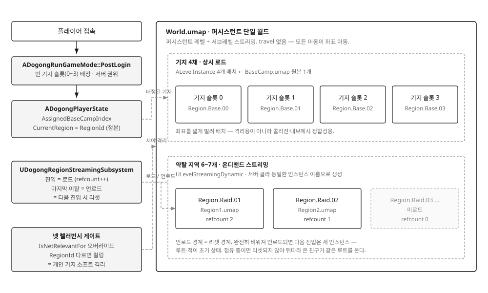

## 배경

Dogong은 탑다운 익스트랙션 슈터입니다. 이 장르의 핵심은 **개인 탈출**입니다. 한
플레이어가 탈출 지점에서 대기를 마치면 **그 사람만** 약탈 지역을 빠져나가 자기
기지로 돌아가고, **나머지는 약탈을 계속합니다.**

제가 이 시스템의 서버·레벨 구조 설계를 맡았습니다. 팀이 준 제약은 넷이었습니다.

1. 데디케이티드 서버를 우리가 호스팅해 줄 여유는 없습니다. 유저에게 배포할 수는 있습니다.
2. 멀티플레이 시 플레이어 개인에게 기지가 하나씩 따로 주어져야 합니다.
3. 기지 외의 약탈 지역은 모든 플레이어가 공유할 수 있어야 합니다.
4. 플레이어는 개인이 자유롭게 기지와 약탈 지역을 출입할 수 있어야 합니다.

설계를 시작하자마자 벽에 부딪혔습니다. **개인 탈출과 리슨 서버 구조가 근본적으로
충돌합니다.**

리슨 서버는 호스트가 곧 플레이어입니다. 그런데 한 명만 다른 레벨로 보내려면 세션을
유지한 채로는 불가능하고, 세션을 떠나 자기 기지로 가는 건 **클라이언트에게만**
가능합니다. 호스트가 같은 짓을 하면 세션이 통째로 붕괴합니다. 즉 호스트만 탈출을
못 하는 구조가 됩니다.

이걸 어떻게 풀 것인가가 이 사례의 전부입니다.

## 구현

### 무엇을 저울질했는가

배치안 세 개를 놓고 비교했습니다. 상세는 아래 '대안 비교'에 적었고, 여기서는 결론만
말하면 **기지와 약탈 지역을 하나의 영속 월드에 공간 분리로 담는 안**을 택했습니다.
한 월드 안이라면 애초에 "다른 레벨로 보낸다"는 문제가 성립하지 않습니다. 탈출은
travel이 아니라 **자기 기지 구역으로 좌표를 옮기는 일**이 됩니다.

이 결정이 서는 순간 `OpenLevel`·`ClientTravel`·`ServerTravel`이 전부 사라졌습니다.
삽입(기지→약탈)과 복귀(약탈→기지)가 **같은 동작 하나**가 됩니다.



### 월드 조립

퍼시스턴트 `World.umap` 하나에 레벨 스트리밍 서브레벨을 붙이는 방식으로 갔습니다.
순수 World Partition이 아니라 명시적 레벨 스트리밍을 고른 이유는, **"목적 지역 로드가
끝난 뒤에 이동을 확정한다"는 대기 절차를 제어하기 쉬웠기 때문입니다.** 로드 요청과
완료 콜백을 제 코드가 직접 쥘 수 있어야 했습니다.

기지 4채는 `BaseCamp.umap` 원본 하나를 `ALevelInstance`로 4번 배치해 상시 로드합니다.
원본 파일이 하나라 아티스트가 네 벌을 관리하지 않아도 되고, 배치마다 고유 좌표를
가져 공간 분리에도 맞습니다. 가벼운 실내 넷이라 상시 로드해도 부담이 적어서
스트리밍 복잡도를 피했습니다.

약탈 지역 6~7개는 반대로 **온디맨드**입니다. 첫 진입 시 로드하고 마지막 이탈 시
언로드합니다. 신뢰하는 친구 4인 규모면 동시에 활성인 지역은 한둘뿐이라, 일곱 개를
전부 상주시키는 건 낭비였습니다.

### 소속을 나타내는 값 하나 — RegionId

이 구조의 중심은 `RegionId`라는 `FGameplayTag` 하나입니다. `Region.Base.00`,
`Region.Raid.01` 같은 계층 태그로, **"이 액터가 지금 어느 지역에 있는가"**를 나타냅니다.

플레이어의 정본은 `ADogongPlayerState::CurrentRegion`에 둡니다. 폰이 아니라
PlayerState에 둔 이유는, **사망으로 폰이 사라지는 순간에도 소속이 유지돼야** 하기
때문입니다.

문제는 대상마다 정본의 위치가 다르다는 점입니다. 폰은 PlayerState에 있고, 적이나
루트 상자는 자기가 속한 지역에서 스탬프된 값을 자기 안에 듭니다. 그래서
`IDogongRegionProvider` 인터페이스를 두고 **접근만 `GetRegionId()` 하나로
균일화**했습니다. 저장 위치는 달라도 읽는 쪽 코드는 하나입니다.

### 개인 기지의 사생활 — 넷 렐러번시 게이트

기지가 약탈 지역과 같은 월드에 있으니, 남의 기지 안이 그냥 보이면 안 됩니다.
격리의 실제 자물쇠는 `IsNetRelevantFor` 오버라이드입니다.

```cpp
// 관찰자와 다른 지역이면 무조건 non-relevant (RegionId 격리 게이트).
bool ADogongCharacterBase::IsNetRelevantFor(const AActor* RealViewer,
    const AActor* ViewTarget, const FVector& SrcLocation) const
{
    if (DogongRegion::ShouldCullByRegion(this, RealViewer, ViewTarget))
    {
        return false;
    }
    return Super::IsNetRelevantFor(RealViewer, ViewTarget, SrcLocation);
}

// Self와 관찰자가 서로 다른(둘 다 유효한) 지역이면 컬링.
// 한쪽이라도 무효면 기본 거리 규칙에 맡긴다 — 배정 전 짧은 구간의 과잉 컬링 방지.
bool DogongRegion::ShouldCullByRegion(const AActor* Self,
    const AActor* RealViewer, const AActor* ViewTarget)
{
    const FGameplayTag SelfRegion   = GetActorRegion(Self);
    const FGameplayTag ViewerRegion = GetViewerRegion(RealViewer, ViewTarget);
    return SelfRegion.IsValid() && ViewerRegion.IsValid() && SelfRegion != ViewerRegion;
}
```

**거리 기반 컬링에 기대지 않은 게 요점입니다.** 거리에만 의존하면 맵을 줄이거나
누군가 `bAlwaysRelevant`를 켜는 순간 격리가 조용히 뚫립니다. 좌표를 넓게 벌려놓기는
했지만 그건 격리용이 아니라 콜리전·내브메시가 겹치지 않게 하는 월드 정합성용입니다.

### 이동 — 서버 권위 텔레포트 + 스트리밍 대기

포탈 상호작용은 `ServerInteract` RPC를 타고 항상 서버에서 실행됩니다. 서버가 검증한
뒤 `UDogongTeleportComponent`가 절차를 진행합니다.

기지행(탈출)은 기지가 상시 로드라 대기 없이 즉시 이동합니다. 약탈 지역행은
`UDogongRegionStreamingSubsystem`에 로드를 요청하고, 준비 완료 콜백을 받은 뒤에
폰을 옮기고 `CurrentRegion`을 갱신합니다. 대기 동안 클라이언트는 로딩스크린으로
가려둡니다.

지역 관리는 **레퍼런스 카운팅**입니다. 진입하면 `RefCount++`, 이탈하면 `--`, 0이 되면
언로드합니다. 여기서 하나 얻은 게 있습니다 — **스트리밍 경계가 그대로 리셋 경계가
됩니다.** 지역이 완전히 비어 언로드됐다가 다시 로드되면 새 인스턴스라 루트와 적이
초기 상태로 돌아옵니다. 별도 리셋 로직이나 저장이 필요 없습니다. 반대로 누군가
점유 중이면 리셋되지 않아서, 친구가 뒤따라 들어오면 같은 루트를 봅니다. 협동
플레이의 의도와도 맞습니다.

로드가 지연될 경우를 대비해 타임아웃(기본 15초)과 재시도 2회를 두고, 소진하면
**취소 후 제자리**로 돌립니다. 기지로 튕겨 보내는 폴백은 쓰지 않았습니다. 플레이어
의도와 다른 곳으로 옮겨지는 게 더 나쁜 결과라고 봤습니다.

기지 슬롯 배정은 `ADogongRunGameMode::PostLogin`에서 서버가 빈 인덱스(0~3)를 주고,
로그아웃 시 즉시 반납합니다. 다만 **스태시 같은 영속 데이터는 기지 슬롯이 아니라
플레이어 세이브에 묶었습니다.** 물리적 기지는 재활용되는 껍데기고, 창고는 사람을
따라다녀야 오늘 0번·내일 2번을 써도 자기 물건이 유지됩니다.

## 장단점

- **장점 — 진입 경로가 하나로 줄었습니다.** travel이 사라지면서 삽입·복귀·지역 이동이
  전부 같은 서버 권위 텔레포트가 됩니다. 앞선 안에서는 "지금 솔로인가 멀티인가",
  "여기가 기지인가 약탈인가"에 따라 `OpenLevel`이냐 `ClientTravel`이냐를 갈라야 했고,
  그 분기 신호를 무엇으로 삼을지가 그 자체로 하나의 결정거리였습니다. 그게 통째로
  사라졌습니다.
- **장점 — 데디와 리슨이 같은 코드로 돕니다.** 이동이 폰 위치 변경이라
  `GetNetMode()`나 "호스트=플레이어" 가정이 코드에 들어갈 자리가 없습니다.
- **장점 — 격리의 자물쇠가 거리가 아닙니다.** `RegionId` 불일치로 판정하기 때문에 맵
  크기나 컬 거리 설정이 바뀌어도 격리가 딸려 흔들리지 않습니다.
- **장점 — 리셋을 위한 코드가 따로 없습니다.** 스트리밍 언로드가 곧 리셋이라, 지역
  상태를 저장했다가 되돌리는 로직이 필요 없습니다.
- **단점 — 소프트 격리입니다.** 남의 기지가 화면에 안 올 뿐, 서버는 모든 기지를 같은
  월드에서 함께 시뮬레이션합니다. 클라이언트에 데이터를 안 보내는 것이지 물리적으로
  분리한 게 아니라서, **신뢰하는 친구 그룹을 전제로만 성립합니다.** 리슨 서버로
  돌리는 동안에는 호스트가 자기 프로세스의 메모리를 들여다보는 것을 구조적으로 막을
  수 없습니다. 이건 결함이라기보다 알고 감수한 선택이고, 공개 매칭을 열려면 전용
  서버로 가야 합니다.
- **단점 — 부하가 한 대에 몰립니다.** 모든 지역과 전원이 서버 한 대에서 돌아가고, 그
  서버가 죽으면 약탈 중인 전원이 종료됩니다. 지역별로 서버를 나누는 안을 버리면서
  같이 포기한 것입니다.
- **단점 — 클라이언트 가시성 대기가 구현에 빠져 있습니다.** 설계에서는 대기 조건을
  *서버 로드 완료 **그리고** 클라이언트 가시화 확인*으로 잡았는데, 실제 코드는 서버
  쪽 `OnLevelShown`만 보고 폰을 옮긴 뒤 곧바로 로딩스크린을 내립니다. 엔진이 서버
  주도 가시성 변경에 트랜잭션 ID를 붙여 **클라이언트가 확인하기 전까지 그 레벨 액터의
  복제를 열지 않는** 것은 맞지만, 그건 액터 복제를 막아줄 뿐 로딩스크린을 붙잡아주지는
  않습니다. 클라이언트 로드가 서버보다 느리면 아직 보이지 않는 레벨 좌표에 폰이 놓인
  채로 화면이 걷힐 수 있는 구간이 남아 있습니다. 대기 조건에 클라이언트 확인을 넣어야
  닫힙니다.
- **단점 — 영속 월드라 별도로 설계해야 하는 것이 생깁니다.** 지역이 점유 중일 때는
  리셋되지 않으므로, 도중에 접속하거나 이탈하는 플레이어의 상태를 어떻게 다룰지는
  이 구조가 자동으로 답해주지 않습니다.

## 대안 비교

|  | A. 지역마다 데디 서버 | B. 단일 데디 + 기지는 로컬 | 선택한 방식 |
|---|---|---|---|
| 약탈 지역 배치 | 지역마다 별도 프로세스 | 데디 한 대의 월드에 좌표 분리 | 한 월드에 좌표 분리 |
| 기지 배치 | 각 클라 로컬 standalone | 각 클라 로컬 standalone | 같은 월드 안에 4채 |
| 기지↔약탈 이동 | 데디 접속 / 해제 | per-client `ClientTravel` | 월드 내 텔레포트 |
| 지역↔지역 이동 | 다른 데디로 재접속 | 같은 월드 내 텔레포트 | 같은 월드 내 텔레포트 |
| 진입 경로 수 | 2 (로컬 ↔ 데디) | 2 (로컬 ↔ 데디) | 1 |
| 기지 격리 | 프로세스 분리 (하드) | 프로세스 분리 (하드) | 넷 렐러번시 (소프트) |
| 부하 | 여러 PC로 분산 가능 | 한 대에 집중 | 한 대에 집중 |
| 추가로 필요한 것 | 세션 디렉터리 + 공유 DB | 없음 | 없음 |

**A(지역마다 데디)를 버린 이유**는 얻는 것에 비해 딸려오는 인프라가 과했기 때문입니다.
부하를 여러 친구 PC로 흩을 수 있는 유일한 안이긴 합니다. 그런데 지역 데디끼리는 서로의
월드를 모르니, 지역을 옮길 때마다 인벤토리·획득 루트·체력을 직렬화해 공유 저장소에
넣고 다음 데디가 읽어 재구성해야 합니다. "Region2는 어느 주소인가"를 알려줄 세션
디렉터리도 상시 필요합니다. 제약 1번(호스팅 여유 없음)에 정면으로 부딪히고, 지역 이동마다
접속을 끊고 다시 붙느라 걸어서 넘어가는 매끄러움도 사라집니다.

**B(단일 데디 + 기지 로컬)를 버린 이유**는 조금 다릅니다. 이건 한때 제가 **채택했다가
되돌린 안**입니다. 기지를 아예 다른 프로세스에 두면 치트로도 못 뚫는 하드 격리가 되고,
헤드리스 데디라 호스트가 플레이어가 아니어서 개인 탈출이 깔끔하게 성립합니다.

되돌린 계기는 **하드 격리가 실제로 무엇을 막아주는지를 다시 따져본 것**이었습니다.
프로세스 분리가 추가로 막아주는 건 "다른 플레이어가 렐러번시를 우회해 남의 창고를
들여다보는 것" 하나뿐입니다. **창고 내용을 위조하는 것은 서버 권위 검증으로 이미
막힙니다.** 신뢰하는 친구끼리 하는 협동 게임에서, 그 방어 하나를 얻자고 진입 경로를
두 벌로 이원화하고 그 둘을 계속 유지보수하는 건 비용이 맞지 않았습니다.

선택한 방식이 치르는 값은 **격리가 소프트해진다는 것**입니다. 위 단점에 적은 그대로,
서버는 모든 기지를 알고 있습니다. 대신 진입 경로가 하나로 줄고 데디·리슨을 코드 분기
없이 함께 지원할 수 있게 됐습니다.

## 회고

**이 결정은 두 번 뒤집혔습니다.** 처음에 단일 월드를 택했다가, 5일 뒤 단일 데디로
바꿨다가, 다시 5일 뒤 단일 월드로 돌아왔습니다.

원인은 분명합니다. **요구가 늦게 확정됐습니다.** 첫 번째 번복은 "기지를 치트로도 못
뚫게 해야 한다"와 "방장이 게임을 꺼도 서버가 살아 있어야 한다"가 요구로 확정되면서
일어났고, 두 번째 번복은 "데디와 리슨을 둘 다 서버 생성 옵션으로 지원한다"가
확정되면서 일어났습니다. 리슨을 옵션으로 여는 순간 호스트가 다시 플레이어가 되므로,
첫 번째 번복이 근거로 삼았던 두 요구를 서버 형태 양쪽에 일관되게 적용할 수 없습니다.
근거가 무너졌으니 결론도 무너졌습니다.

**제가 성급했던 지점은 "데디 한 대 / 호스트≠플레이어"를 하드 요구로 못박은 것입니다.**
서버 형태는 처음부터 옵션으로 열어뒀어야 할 축이었는데, 저는 그걸 확정된 전제처럼
다뤘습니다. 다시 한다면 8월 14일 시점에 **어떤 요구가 아직 확정되지 않았는지를 먼저
목록으로 만들고**, 그 요구들이 뒤집혔을 때 각 안이 얼마나 흔들리는지를 비교표에
함께 넣었을 겁니다. 세 안의 장단점만 비교했지, "이 근거가 사라지면 어떻게 되는가"는
따지지 않았습니다.

한 가지 덧붙이면, **마지막 번복은 제 판단이 아니라 팀원의 요구를 받아들인 것입니다.**
기술적으로는 지금도 단일 데디 쪽이 낫다고 보고 있습니다 — 공개 매칭을 열 계획이
있다면 언젠가는 전용 서버로 가야 하고, 그렇다면 리슨 가정이 코드에 스며들기 전에
일찍 옮기는 편이 총비용이 싸다는 판단이었습니다. 다만 서버 형태를 사용자가 고르는
옵션으로 열어두자는 팀 결정 아래에서는 그 판단을 유지할 근거가 없어서 되돌렸습니다.

다만 되돌린 뒤에 하나 확실히 얻은 게 있습니다. **판단이 뒤집힐 때마다 무엇이 틀렸고
무엇이 그래서 바뀌는지를 그때그때 문서로 남긴 것**이, 두 번째 번복 때 결정적으로
도움이 됐습니다. 첫 번째 번복 기록에 "4.1이 근거로 삼은 요구가 무엇인지"를 적어뒀기
때문에, 새 요구가 들어왔을 때 **그 근거가 아직 유효한지만 확인하면** 됐습니다. 세
안을 처음부터 다시 저울질할 필요가 없었습니다.
